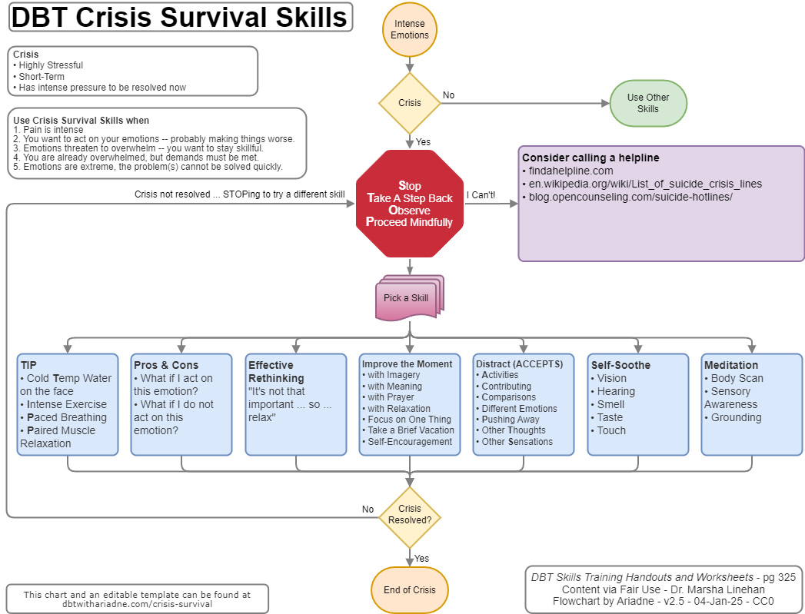
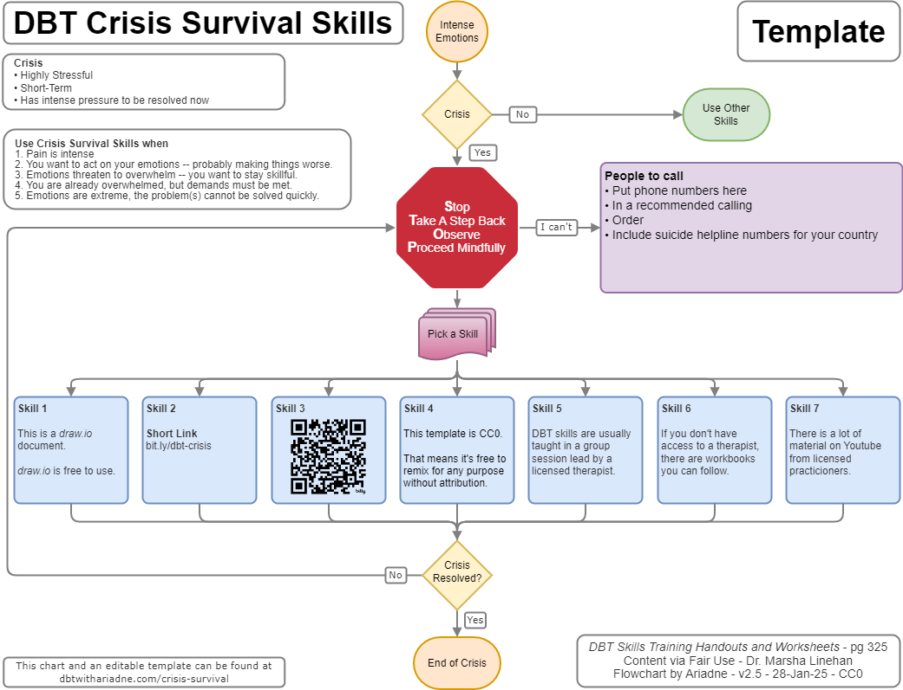

# DBT Crisis Survival Skills

This is a DBT Crisis Survival and Distress Tolerance flowchart. It uses the skills from Marsha Linehan's book.

I made it for my fridge, because when I'm in crisis, I can't really remember anything.

The chart is meant to serve as a printable shorthand in-crisis reminder to use skills vs *making the crisis worse.*

[DBT Crisis Survival - draw.io](drawio-charts/dbtwithariadne-crisis-survival-skills.drawio)

Download the file, then edit via [draw.io](https://app.diagrams.net/).

[Template - DBT Crisis Survival - draw.io](drawio-charts/dbtwithariadne-crisis-survival-skills-template.drawio)

Download the file, then edit via [draw.io](https://app.diagrams.net/).

# References

[DBT Skills Training Manual, 2nd Ed. Marsha M. Linehan (2015) New York](https://doi.org/10.1097/nmd.0000000000000387)

**Distress Tolerance Handout 10** pg. 341

---------------------

v2.2 - Last edit 4-Jan-2025

This work dedicated to the Public Domain via [CC0 1.0](https://creativecommons.org/publicdomain/zero/1.0/)