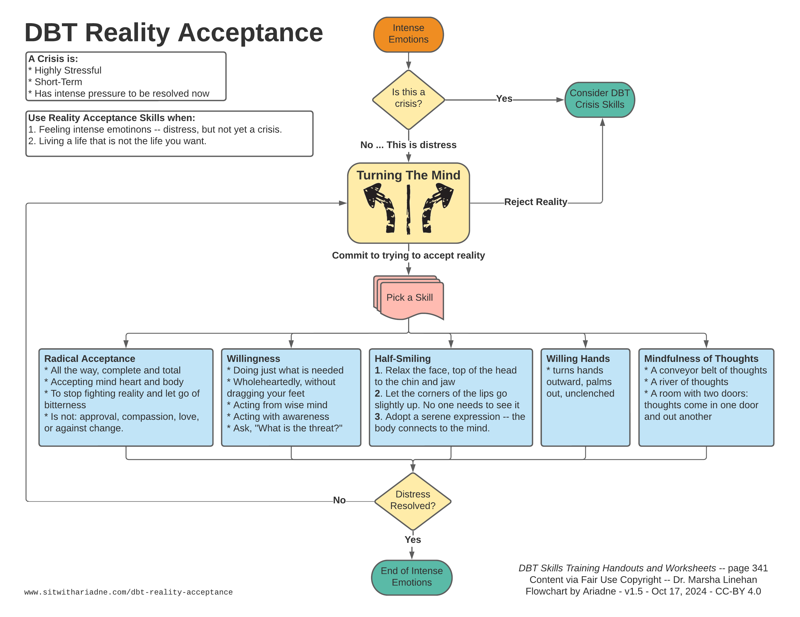

This is a DBT Reality Acceptance chart, based in part on Marsha Lineham's book.

The chart is meant to serve as a printable shorthand to help re-train behavior to ease day-to-day emotional turmoil.

The skills and how to use the skills are found in the DBT skills manual.

[DBT Reality Acceptance - draw.io](drawio-charts/dbtwithariadne-reality-acceptance-skills.drawio)

# References

[DBT Skills Training Manual, 2nd Ed. Marsha M. Linehan (2015) New York](https://doi.org/10.1097/nmd.0000000000000387)

**Distress Tolerance Handout 10** pg. 341

---------------------------------

v2.1 - Last edit 4-Jan-2025 
 
This work is dedicated to the Public Domain via [CC0 1.0](https://creativecommons.org/publicdomain/zero/1.0/)
