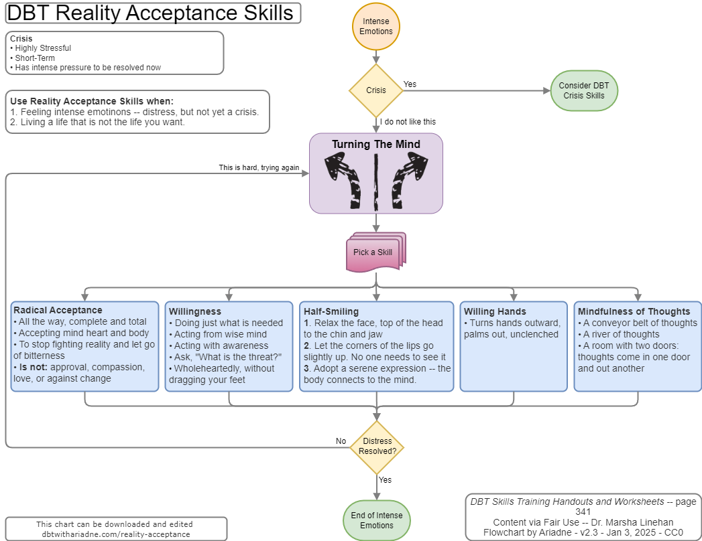

# DBT Reality Acceptance Skills

This is a DBT Reality Acceptance Skills flowchart. It uses the skills from Marsha Linehan's book.

The chart is meant to serve as a printable shorthand to help re-train behavior to ease day-to-day emotional turmoil.

[DBT Reality Acceptance - draw.io](drawio-charts/dbtwithariadne-reality-acceptance-skills.drawio)

Download the file, then edit via [draw.io](https://app.diagrams.net/).

# References

[DBT Skills Training Manual, 2nd Ed. Marsha M. Linehan (2015) New York](https://doi.org/10.1097/nmd.0000000000000387)

**Distress Tolerance Handout 10** pg. 341

---------------------------------

v2.2 - Last edit 4-Jan-2025
 
This work is dedicated to the Public Domain via [CC0 1.0](https://creativecommons.org/publicdomain/zero/1.0/)
